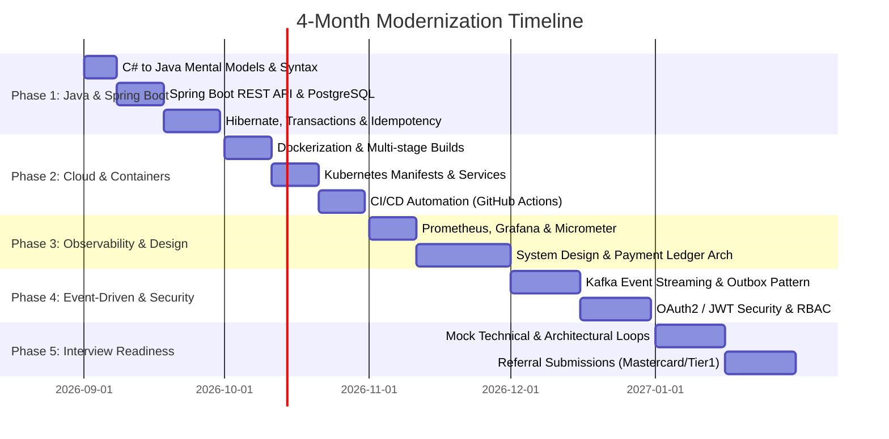

# 🚀 4-Month Technical Modernization Roadmap (Sept 2026 – Jan 2027)
**Target:** Senior Software Engineer (L7) / Lead Architect (Enterprise Fintech / Payments Focus)  
**Anchor Project:** `PayPulse-Core` (High-Throughput, Idempotent Payment & Ledger Engine)  
**Mentorship Model:** Learning How to Learn (Active Recall, Spaced Repetition, Chunking, L7 Articulation Drills)

---

## 🧭 Milestone Overview

---

## 📊 Phase-by-Phase Tracking

| Phase | Timeline | Core Focus | Deliverables & Artifacts | Status |
| :--- | :--- | :--- | :--- | :--- |
| **Phase 1** | Sept 2026 | **Java 17+ & Spring Boot** | Core REST API, Double-entry Ledger, PostgreSQL, Idempotency keys, 10 LeetCode problems | 🟡 **Active** |
| **Phase 2** | Oct 2026 | **Cloud & Containerization** | Multi-stage Dockerfile, Local K8s manifests, GH Actions CI/CD Pipeline | ⚪ Upcoming |
| **Phase 3** | Nov 2026 | **Observability & System Design** | Prometheus/Grafana metrics, Structured Logging, Distributed Tracing, System Design Briefs | ⚪ Upcoming |
| **Phase 4** | Dec 2026 | **Event Streaming & Security** | Kafka Producer/Consumer, Outbox Pattern, OAuth2 / JWT Auth, Quantified Resume Bullet Points | ⚪ Upcoming |
| **Phase 5** | Jan 2027 | **Enterprise Readiness** | System Design & Coding Mocks, Polished L7 Storytelling, Application / Referral Launch | ⚪ Upcoming |

---

## 🧠 The Daily Operating Cadence (LHtL Framework)

Designed for **30–45 min sprint blocks** (Lunch, Remote Morning, Evening Catchup):

1. **Active Retrieval Drill (3–5 mins):**
   * Review flash questions on previous concepts without looking at code.
2. **Focused Sprint (25–30 mins):**
   * Single-purpose coding task or concept breakdown (e.g., building a repository, configuring transaction boundaries, writing a unit test).
3. **L7 Articulation Drill & Synthesis (5–7 mins):**
   * Practice articulating *why* decisions were made, trade-offs evaluated, and how it translates from C# / CLR to Java / JVM.
4. **Diffuse Consolidation (Off-screen / Commute / Workouts):**
   * Letting high-level concepts sink in during mobility, runs, or commute mindset resets.

---

## 📐 Architecture Decision Records (ADRs)

| ADR # | Title | Date | Status |
| :--- | :--- | :--- | :--- |
| [ADR-0001](file:///c:/VisualStudioCode/Upskilling/docs/adr/ADR-0001-Architecture-Vision.md) | Capstone Domain Vision & Baseline Technology Stack | 2026-09-01 | **Accepted** |

---

## 🧩 LeetCode & Problem Solving Tracker (Java Focus)

*Target: 2–3 problems per week (Arrays, Hash Maps, Two Pointers, Trees).*

| Date | Problem | Category | Difficulty | Key Pattern / Insight |
| :--- | :--- | :--- | :--- | :--- |
| -- | -- | Arrays & Hashing | -- | -- |
