# 🌿 Git Mental Model for TFS / Visual Studio Veterans

> **Purpose:** Overcoming the CLI barrier and transforming TFS/TFVC server-centric instincts into modern Git distributed workflows.

---

## 🧠 The Core Paradigm Shift: TFS vs. Git

```mermaid
flowchart TD
    subgraph TFS["TFS / TFVC (Centralized Server Model)"]
        TFS_Server[("TFS Central Server<br/>(Single Source of Truth)")]
        TFS_Local["Working Directory<br/>(Files checked out/locked)"]
        TFS_Local -- "Check-in (Immediate Server Write)" --> TFS_Server
    end

    subgraph Git["Git (Distributed 3-Stage Local Model)"]
        Git_Work["1. Working Directory<br/>(Files you edit)"]
        Git_Stage["2. Staging Area (Index)<br/>(The loading dock / box)"]
        Git_LocalRepo["3. Local Repository<br/>(Immutable commit snapshot)"]
        Git_Remote[("4. Remote (GitHub/GitLab)<br/>(Cloud backup / PR target)")]

        Git_Work -- "git add (Pack box)" --> Git_Stage
        Git_Stage -- "git commit (Seal & timestamp box)" --> Git_LocalRepo
        Git_LocalRepo -- "git push (Ship all boxes)" --> Git_Remote
    end
```



### 3 Key Insights for Visual Studio Users
1. **Committing is Local & Offline:** In TFS, checking in required communicating with the server. In Git, a `commit` is purely on your local machine. You can commit 10 times on an airplane with no internet.
2. **The Staging Area (The "Loading Dock"):** TFS didn't have this. In Git, before you commit, you explicitly decide which changes go into the next snapshot via `git add`.
3. **Nothing is Lost Locally:** Commits are immutable snapshots. Even if you make a mistake, Git's `reflog` keeps a safety net of everything you did locally.

---

## 🛠️ The Only 5 CLI Commands You Need 80% of the Time

| Step | Command | What It Does | Visual Studio / TFS Equivalent |
| :--- | :--- | :--- | :--- |
| **1. Check Status** | `git status` | Shows modified, untracked, and staged files | Looking at the "Pending Changes" window |
| **2. Stage Changes** | `git add .` *(or `git add <file>`)* | Moves modified files into the Staging Area | Checking the checkbox next to files in Pending Changes |
| **3. Create Snapshot** | `git commit -m "type: message"` | Creates an immutable local snapshot with a message | Clicking "Check In" (but local only!) |
| **4. View History** | `git log --oneline -n 5` | Shows recent commits in a clean single-line graph | Viewing "History" in Visual Studio |
| **5. Push to Remote** | `git push` | Sends your local commits to the remote server | The final server synchronization |

---

## 📝 Conventional Commits Standard (L7 Industry Standard)

Instead of generic commit messages like `"updated code"`, enterprise teams follow **Conventional Commits**:

- `feat: add idempotent transaction processing filter` (New feature)
- `fix: resolve null pointer in account balance calculation` (Bug fix)
- `docs: create adr-0001 for architecture baseline` (Documentation only)
- `refactor: extract double-entry validation logic to domain service` (Code change without feature/bug change)
- `test: add unit tests for debit/credit balance constraint` (Adding or fixing tests)

---

## 🛡️ Quick Safety & Emergency Guide

- **Want to undo unstaged changes to a file?**
  ```bash
  git restore <file>
  ```
- **Want to temporarily set work aside without committing (TFS Shelveset equivalent)?**
  ```bash
  git stash        # Save work to local stash
  git stash pop    # Bring it back when ready
  ```
- **Want to see what lines changed before adding?**
  ```bash
  git diff
  ```
